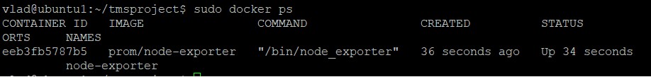
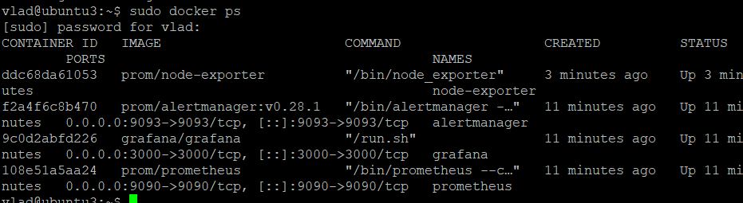
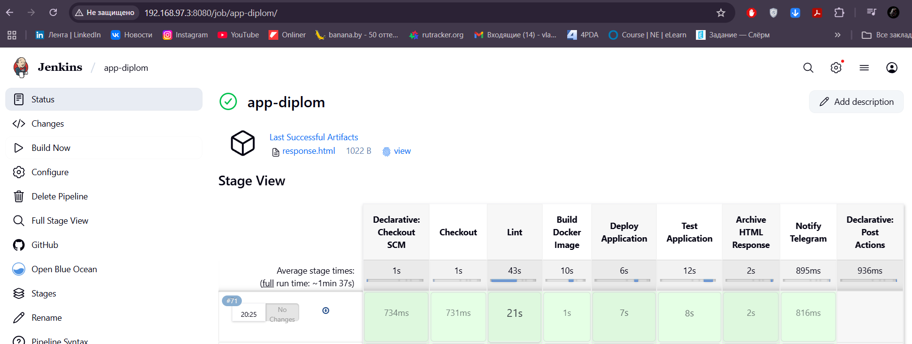
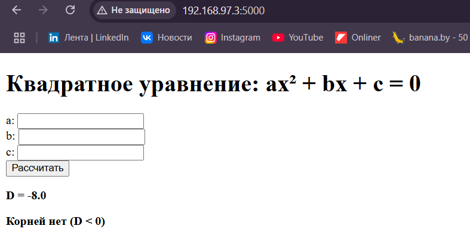
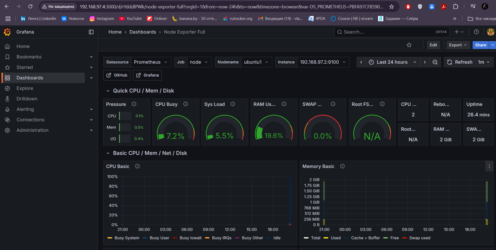
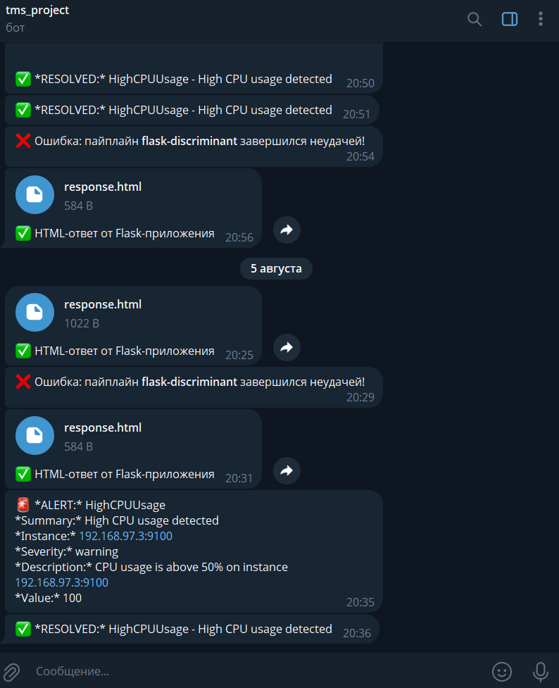

## 🚀 DevOps Диплом — Автоматизация от идеи до мониторинга
Добро пожаловать в дипломный проект, созданный в рамках обучения в TMS School. Здесь DevOps-подход обретает реальную форму — от инфраструктуры до готового приложения под контролем мониторинга и CI/CD.

---

## 🎯 Что вы найдёте в этом проекте
Проект охватывает весь цикл внедрения DevOps-практик:

✅ Автоматизация серверной части через Ansible

🔄 Полноценный CI/CD Pipeline в Jenkins

🐳 Контейнеризация с помощью Docker

📈 Сбор и визуализация метрик через Prometheus + Grafana

🚨 Система алертов с Alertmanager, интеграция с Telegram

🧮 Веб-приложение — Вычесление дискриминанта на Flask

---

## 🧩 Репозитории проекта

Проект разбит на два основных репозитория:

| Компонент | Ссылка |
|------------|-------------|
| Автоматизация и Jenkins | [tmsprojectdiplom](https://github.com/Vlados752/tmsprojectdiplom/tree/main/roles) |
| Исходники и пайплайн | [app_tms](https://github.com/Vlados752/app_tms/tree/main) |
| Скачать готовый Jenkins со всеми настройками | [Jenkins](https://drive.google.com/file/d/1YPulxr_Xo4aC_XqBqA2Zd1Ri0GFtyWgU/view?usp=sharing) |

---

## 🛠 Что под капотом

3 сервера на Ubuntu 22.04.01

Хост 1 — Docker, Ansible, Node Exporter

Хост 2 — Docker, Node Exporter, Jenkins

Хост 3 - Docker, Node Exporter, Alertmanager, Prometheus, Grafana

SSH-соединение между машинами 

Системные требования: 2 vCPU и 2 GB RAM

---

## 📦 Как развернуть проект

1. Клонируйте репозиторий:

   ```bash
   git clone https://github.com/Vlados752/tmsprojectdiplom.git
   ```

2. Задайте настройки:

   - Отредактируйте `hosts.ini` с IP-адресами ваших серверов
   - Настройте параметры в `group_vars/all.yml` (например, Telegram token, IP и т.д.)

3. Запустите playbook:

   ```bash
   ansible-playbook -i hosts.ini deploy.yml --ask-vault-pass
   ```

**Проверка создания контейнеров на исполняемых хостах:**

Хост 1:



Хост 2:


Хост 3:



---

## 🔄 Jenkins Pipeline: шаг за шагом

1. Откройте браузер по адресу `http://<IP>:8080` и авторизуйтесь в Jenkins
2. Запустите Jenkins pipeline:
   - Скачивает исходный код приложения [исходный код приложения (Вычесление дискриминанта flask)](https://github.com/Vlados752/app_tms)
   - Проверяет код flake8-линтером
   - Собирает Docker-образ
   - Запускает тесты
   - Отправляет уведомление в Telegram
3. После успешного запуска, приложение будет доступно по адресу `http://<IP>:5000`

**Успешно завершённый пайплайн:**



**Доступное приложение "Вычесление дискриминанта":**



---

## 📊 Мониторинг без лишнего шума
- Prometheus — метрики Jenkins и Flask
- Grafana — дашборды для аналитики
- Alertmanager — пуш-уведомления в Telegram

**Grafana Dashboard:**



**🚨 Полученные алерты в Telegram:**



---

## 📌 Полезные команды

```bash
# Проверить статус всех сервисов Docker
docker ps -a

# Перезапустить Jenkins
sudo systemctl restart jenkins

# Посмотреть логи Prometheus
docker logs prometheus

# Проверка SSH-доступа
ssh user@host2
```

---

## 🧯 Частые проблемы — быстрые решения

- Jenkins не стартует? - Проверьте Java и логи /var/log/jenkins/jenkins.log
- Ошибка линтинга? - Установите flake8
- Нет алертов? - Проверьте настройки Telegram-бота

---

## 📮 Контакты

Разработчик: **Маслов Владислав**  
📧 Email: [vladi4ej@gmail.com](mailto:vladi4ej@gmail.com)

---


